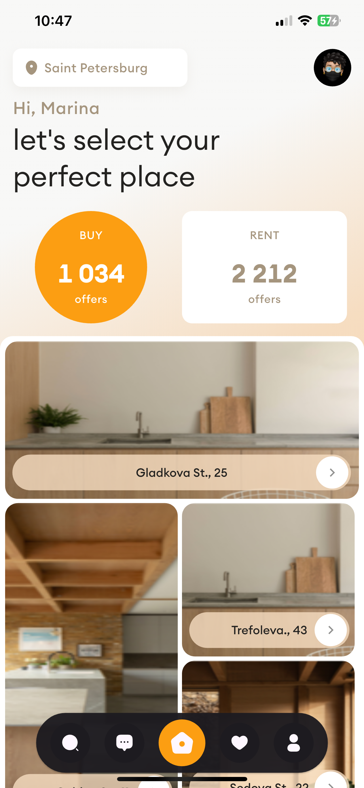
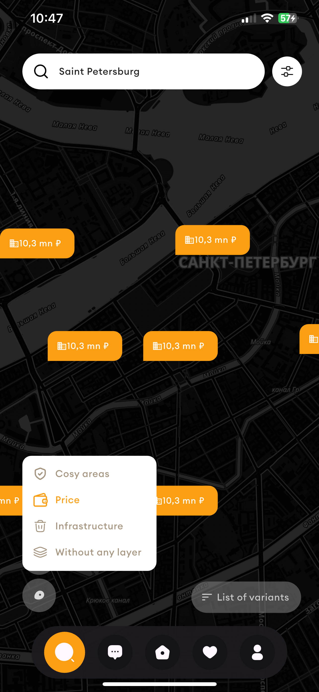
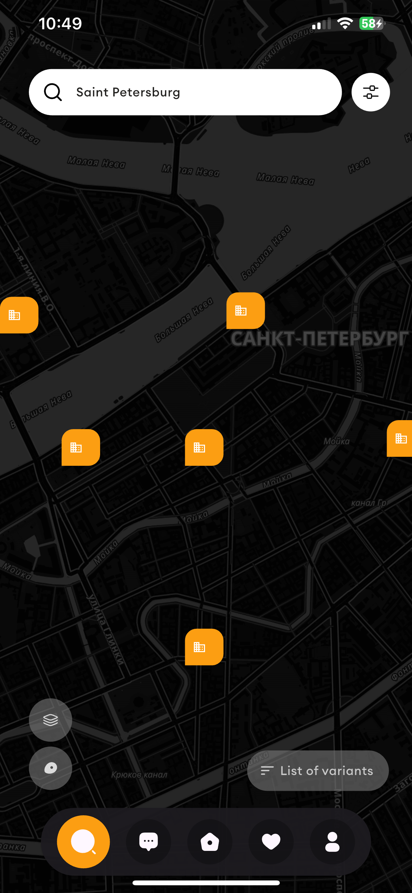

# real_estate_app
UI clone of a shipping app.


## Screenshots of the app

<p float="center">
  
  
  
</p>

## Getting Started
This repository contain the code for the Real Estate App. This project was written using the Flutter 3.29.2 SDK and Dart programming Language. If you're new to Flutter and Dart, Check out the SDK at https://www.flutter.dev and the language at https://dart.dev/.

## How to Use

**Step 1:**

You must have Flutter and Dart Installed to build this project. Check the links above if you haven't done so. You might experience build issues running on a lower flutter version. If you don't have flutter ^3.0.0, You can use fvm to download it and manage your flutter version locally. I have included a link to it.

```
https://fvm.app/
```

Download or clone this repo by using the link below:

```
https://github.com/BashirYesufu/Real-Estate-App.git
```

**Step 2:**

Run your simulator for iOS or android emulator and smash the build button. Easy!

## Conclusion
May The Code be with you.

